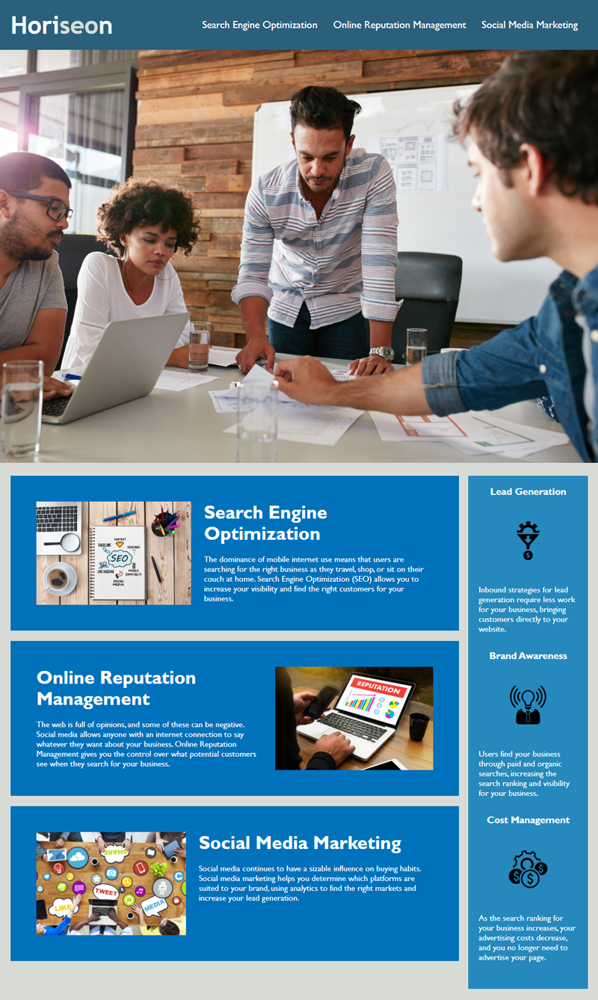

# Horiseon-Refactor-Module-1

## Description
The first module of the bootcamp is to refactor the code for Horiseon to make it more accessible. The below Acceptance Criteria details what was done to achieve the meeting of accessibility standards: 
- changes were made to the HTML structure and element names; 
- changes to the CSS structure and class selector names were made; 
- alt text was added to each image; 
- a unique title was created for SEO; 
- comments were added to the CSS to better keep track of contents.

## Installation
N/A

## Usage
Users can utilize this source to learn more about SEO and using the internet to market a business.

## Credits
N/A

## Acknowledgements
[Github User README Template](https://github.com/othneildrew/Best-README-Template.git)

[Markdown Guide](https://www.markdownguide.org/cheat-sheet/)

[Organizing your CSS](https://developer.mozilla.org/en-US/docs/Learn/CSS/Building_blocks/Organizing)

### User Story
*AS A marketing agency*

I WANT a codebase that follows accessibility standards

SO THAT our own site is optimized for search engines

### Acceptance Criteria
*GIVEN a webpage meets accessibility standards*

**WHEN** I view the source code
**THEN** I find semantic HTML elements

**WHEN** I view the structure of the HTML elements
**THEN** I find that the elements follow a logical structure independent of styling and positioning

**WHEN** I view the image elements
**THEN** I find accessible alt attributes

**WHEN** I view the heading attributes
**THEN** they fall in sequential order

**WHEN** I view the title element
**THEN** I find a concise, descriptive title

